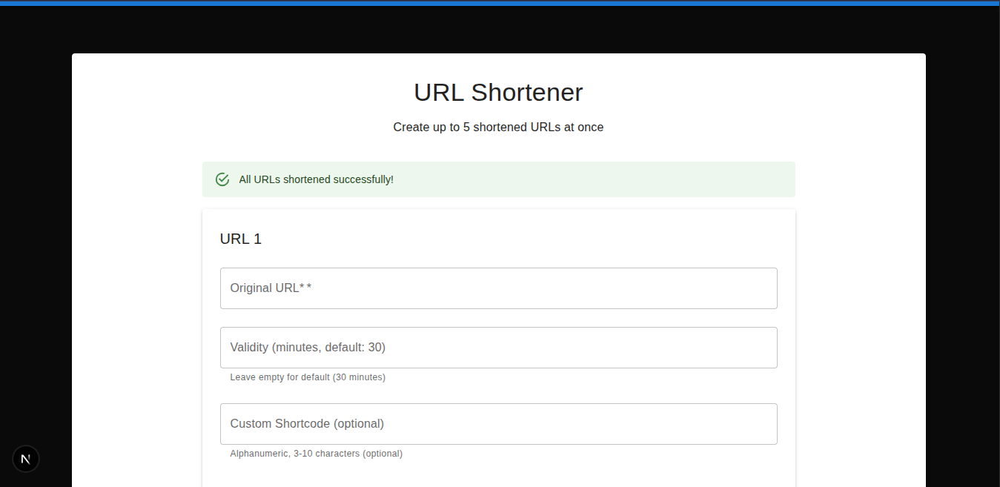

# URL Shortener - The Submission They Couldn't "Afford" to Accept 🙄

## Overview

This is a fully functional URL shortener application built with Next.js and React that was created for an **Affordmed** internship technical test. Ironically, despite being the **only candidate out of 80 people** who managed to complete the task within the allocated time, this submission was rejected because it was submitted "a couple of seconds late."

Apparently, **Affordmed** (the company that can't "afford" to pay their interns) values punctuality over actual coding ability. Who knew that being microseconds late was more important than being the sole person capable of solving their technical challenge? 🤷‍♂️

## Features



_The URL Shortener application in action - showing the bulk URL creation form with validation and success feedback._

### 🚀 Core Functionality

- **Bulk URL Shortening**: Create up to 5 shortened URLs at once
- **Custom Shortcodes**: Set your own custom shortcodes (3-10 alphanumeric characters)
- **URL Validation**: Comprehensive URL validation with helpful error messages
- **Expiry Management**: Set custom expiry dates for URLs
- **Click Tracking**: Monitor how many times each shortened URL has been accessed
- **Statistics Dashboard**: View all your URLs and their performance metrics
- **Automatic Redirection**: Seamless redirection from short URLs to original destinations
- **Error Handling**: Graceful handling of expired URLs and invalid shortcodes

### 🛠 Technical Features

- **Modern UI**: Beautiful Material-UI components with responsive design
- **Context Management**: React Context for state management
- **Client-Side Routing**: Next.js App Router with dynamic routes
- **Custom Logging**: Built-in logging middleware for debugging and monitoring
- **Input Validation**: Robust client-side validation utilities
- **Local Storage**: Persistent data storage in browser

### 📊 Statistics & Analytics

- View all shortened URLs in a comprehensive table
- Track click counts for each URL
- Monitor expiry status
- Sort and filter capabilities

## Installation & Setup

### Prerequisites

- Node.js (v18 or higher)
- npm or yarn package manager

### Step 1: Clone the Repository

```bash
git clone https://github.com/yourusername/Url-Shortner-With-Custom-Logger.git
cd Url-Shortner-With-Custom-Logger
```

### Step 2: Install Dependencies

```bash
# Install logging middleware dependencies
cd logging-middleware
npm install

# Install frontend dependencies
cd ../url-shortner
npm install
```

### Step 3: Run the Application

```bash
# From the url-shortner directory
npm run dev
```

The application will start on `http://localhost:3000`

### Alternative: Production Build

```bash
npm run build
npm start
```

## Project Structure

```
├── url-shortner/                     # Main Next.js application
│   ├── src/
│   │   ├── app/                      # Next.js App Router pages
│   │   │   ├── page.js               # Home page with URL form
│   │   │   ├── stats/                # Statistics page
│   │   │   └── [shortcode]/          # Dynamic route for URL redirection
│   │   ├── components/               # Reusable React components
│   │   │   ├── Navigation.js         # Navigation bar
│   │   │   ├── StatsTable.js         # Statistics table component
│   │   │   └── UrlForm.js            # URL shortening form
│   │   ├── context/                  # React Context providers
│   │   │   └── UrlContext.js         # URL management context
│   │   └── utils/                    # Utility functions
│   │       ├── validators.js         # Input validation functions
│   │       └── logger/               # Logging utilities
│   └── package.json
├── logging-middleware/               # Custom logging middleware package
│   ├── index.js                     # Middleware implementation
│   └── package.json
└── README.md                        # This file
```

## Usage

### Creating Shortened URLs

1. Navigate to the home page
2. Enter your URL(s) in the form fields
3. Optionally set custom shortcodes and expiry dates
4. Click "Shorten URLs" to generate your shortened links
5. Copy and share your shortened URLs

### Viewing Statistics

1. Click on "Statistics" in the navigation
2. View all your created URLs with their click counts
3. Monitor expiry status and performance

### Using Shortened URLs

- Visit any shortened URL (e.g., `http://localhost:3000/abc123`)
- You'll be automatically redirected to the original URL
- Click counts are tracked automatically

## Technology Stack

- **Frontend**: Next.js 15, React 19
- **UI Framework**: Material-UI (MUI)
- **Styling**: CSS Modules, Emotion
- **State Management**: React Context
- **HTTP Client**: Axios
- **Validation**: Custom validation utilities
- **Logging**: Custom logging middleware

## The Affordmed Story 📖

This project represents more than just code—it's a testament to the absurd expectations in today's job market. Here's what happened:

1. **80 candidates** were given a technical challenge
2. **Only 1 person** (yours truly) completed it within the time limit
3. Submission was rejected for being "seconds late"
4. **Affordmed** apparently can't "afford" to recognize actual talent

The irony is rich: a company called "Affordmed" that can't afford to:

- Pay their interns fair wages
- Recognize coding competency over arbitrary time constraints
- Value problem-solving skills over stopwatch precision

This submission stands as proof that some companies prioritize bureaucratic nonsense over genuine technical ability. They wanted perfection in impossible timeframes while offering intern-level compensation.

## Contributing

Feel free to fork this project and improve upon it. Unlike **Affordmed**, I actually appreciate when people contribute value, regardless of whether they're a few seconds "late."

## License

This project is open source and available under the MIT License. Use it freely—unlike some companies, I don't charge for access to quality work.

---

**Fun Fact**: The time spent writing this README was probably longer than the "couple of seconds" that got this submission rejected. Priorities, right? 😏

_Built with passion, rejected with prejudice._ ✨
